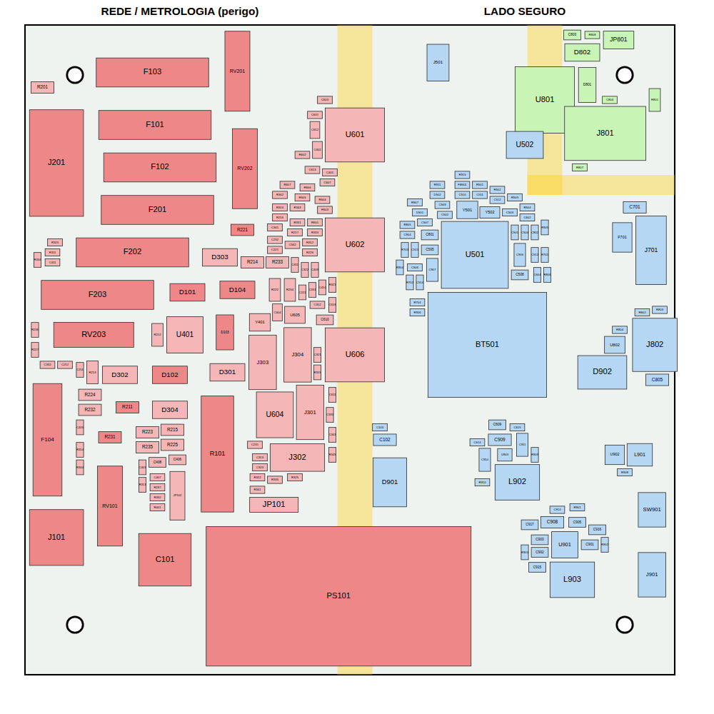
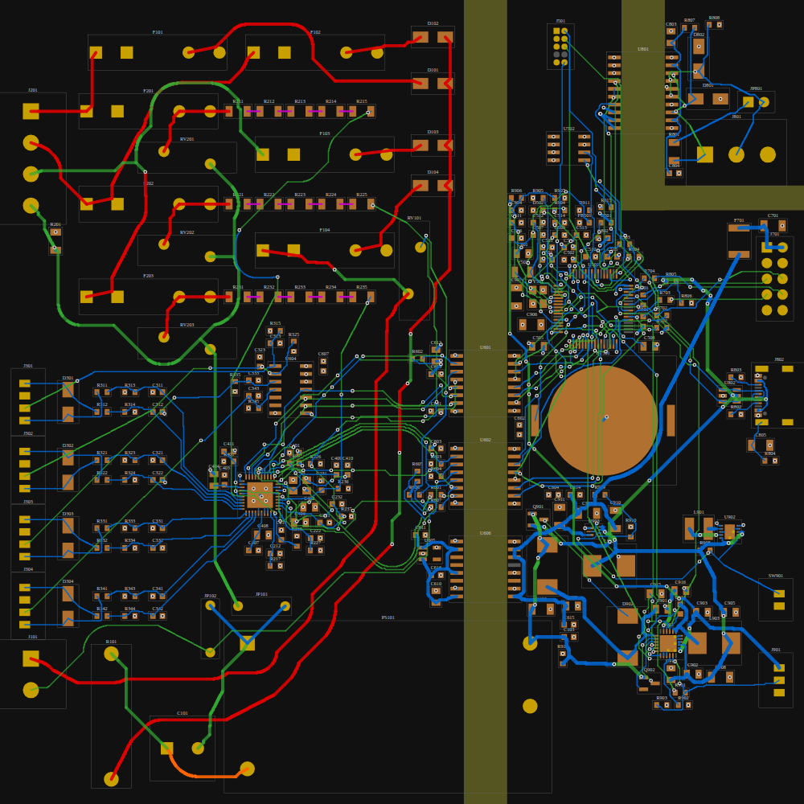
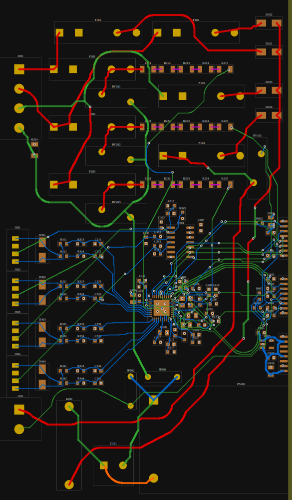
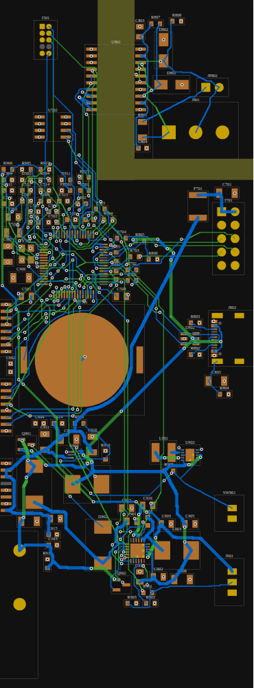
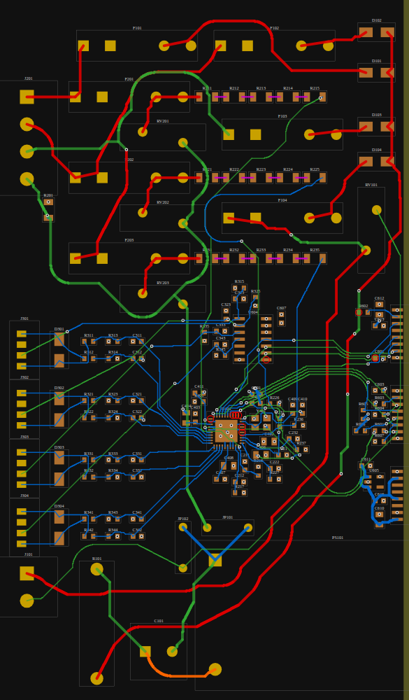
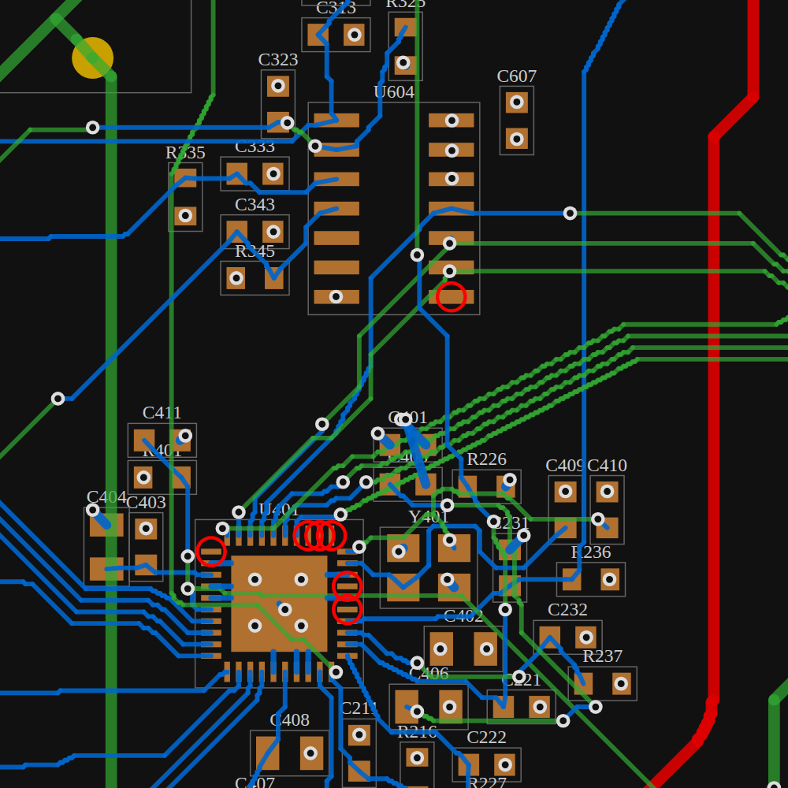

# Layout da placa de metrologia — rev. 0.5 (placa roteada, todas as ligações feitas)

*Vermelho escuro: nets de rede. Vermelho claro: domínio metrológico (potencial da rede). Azul: domínio seguro. Verde: RS-485 isolada. Amarelo: faixas da barreira (sem cobre).*

## Placa roteada (rev. 0.5)

Domínio quente e lado seguro (com a ilha RS-485) roteados com as regras abaixo, a creepage de 8 mm na barreira e as correções da revisão do PR #1. Na rev. 0.5 todas as ligações do esquemático estão feitas (ver "Ligações da rev. 0.5" abaixo).

| Domínio quente | Lado seguro e ilha RS-485 |
|---|---|
|  |  |

No lado seguro: GND_SYS e GND_485 em In1.Cu, +3V3 em In2.Cu, trilhas de potência (POWER) de 0,6 mm, estreitadas para a largura do pad (0,2 mm) na saída dos CIs de passo fino (U901, U902, U903, J802). Os CIs de passo fino foram deslocados até 0,05 mm para os pads caírem na grade de roteamento. Alguns trechos curtos usam In2.Cu como camada de sinal quando não havia outro caminho (149 trechos na placa); o plano de In2 é preenchido em volta deles. Nas ligações feitas nos reparos há 100 vias menores (0,45/0,2 mm); as demais vias são de 0,6/0,3 mm. As regras da placa (`.kicad_pro`) aceitam essas vias: diâmetro mínimo 0,45 mm, furo mínimo 0,2 mm.

### Rev. 0.2 (só o domínio quente)

*Vermelho: rede (MAINS/HVBUS). Magenta: nós internos dos divisores. Azul: sinais do domínio metrológico em F.Cu. Verde: B.Cu. Círculos vermelhos: pads ainda sem ligação.*

O **domínio quente** (à esquerda da barreira) está **roteado em parte**: entradas de rede, fusíveis, varistores, divisores de tensão, entradas de corrente, ADE9430 com desacoplamento, cristal e filtros, lado quente dos isoladores e entrada do PS101, com as ligações pendentes listadas abaixo. O lado seguro e a ilha RS-485 ficam para a próxima etapa.

Regras usadas pelo roteador (iguais ou mais rígidas que as do `.kicad_dru`):

| Situação | Distância mínima |
|---|---|
| Rede ↔ rede de outra fase, rede ↔ domínio metrológico | 3,0 mm (roteado com 3,2 mm) |
| Divisor ↔ divisor de outra fase | 3,0 mm |
| Divisor ↔ sinais do domínio metrológico | 2,0 mm (0,5 mm na mesma fase) |
| Sinais do domínio metrológico entre si | 0,2 mm |
| Trilhas | rede 0,5 mm; divisores 0,3 mm; NEUTRAL/HV_RTN/+5V_ISO 0,5 mm; +3V3_ADE/GND 0,4 mm; sinais 0,2 mm (0,25 mm nos pinos de alimentação do ADE9430) |
| Vias | 0,6 / 0,3 mm |

Decisões de layout:

- **Neutro** em espinha na B.Cu, ligando RV201–RV203, J201 e JP101 por baixo das linhas de fase (que ficam na F.Cu).
- **Retificadores D101–D104** agrupados ao lado de F101–F104, com o catodo comum voltado para a barreira. O barramento retificado desce por uma coluna própria (x ≈ 61 mm) entre os filtros das entradas de tensão e o grupo U604/pull-ups, sem cruzar o ADE9430.
- **ADE9430**: entradas de corrente pelo lado esquerdo (pinos 7–14), tensões pelo lado de baixo e direito, sinais digitais por cima. Pinos de GND ligados direto ao pad exposto, com 5 vias no EP para o plano GND (In1.Cu).
- **Planos**: GND em In1.Cu e +3V3_ADE em In2.Cu no domínio quente; ligações por vias junto de cada pad.

### Verificação

Verificação geométrica própria da placa inteira (trilha/via contra todo cobre de outro net, barreiras e borda): **0 violações** com as distâncias da tabela acima. Menor distância entre cobre quente e cobre seguro através da barreira (fora as fileiras de pads dos próprios isoladores): **8,02 mm**.

**Falta rodar o DRC do KiCad** (inclui creepage e as regras do `.kicad_dru`) e preencher as zonas (**B**).

### Ligações da rev. 0.5

Na rev. 0.4 havia 10 pads listados como pendentes. Uma verificação de conectividade da placa inteira (cobre de cada net agrupado por contato, vias e planos) achou mais 5 ligações abertas que o roteador tinha dado como feitas: VSYS (U901.15/16 isolados do resto), VBUS (pinos do J802), HSE_IN (C510), VDDA (C506) e +3V3_ADE (R605/R606 sem via para o plano). As 15 foram ligadas por um roteador local em grade de 0,05 mm, que remove e refaz as trilhas vizinhas quando o caminho está fechado (pinos de passo fino do U401, U501 e U901). Cerca de 40 nets vizinhos foram refeitos nessas regiões.

Depois disso: 0 ligações abertas, 0 violações de distância na verificação própria e 8,02 mm de distância mínima entre cobre quente e seguro.

Pontos a revisar no KiCad:

| Net | Situação | Sugestão |
|---|---|---|
| /Power Supplies/VSYS | saída SYS do BQ25895 (U901.15/16) com 4,4 mm de trilha de 0,3 mm | alargar ou trocar por área de cobre; o SYS conduz até ~3 A |
| /Power Supplies/SW_5V | nó de comutação do TPS61022 (U903.2 → L902) com ~9 mm de trilha de 0,2 mm e duas vias (vem da rev. 0.4) | aproximar L902 do U903 e ligar com cobre largo |
| /Power Supplies/VBAT | ramo até o divisor R906 com ~83 mm de trilha de 0,4 mm (corrente de µA) | aceitável; encurtar se R906 for aproximado do U901 |
| CHG_N | ~73 mm entre U901.4 e o MCU | aceitável (sinal lento) |

A regra "Trilhas de potencia" do `.kicad_dru` passou a mínimo 0,2 mm com valor ótimo de 0,6 mm. A versão anterior (mínimo 0,6 mm) reprovaria os estreitamentos na saída dos CIs de passo fino.

Próximos passos: preencher as zonas (**B**), rodar o DRC, revisar os pontos onde a rede cruza o domínio metrológico em camadas diferentes (o plano GND em In1.Cu e o +3V3_ADE em In2.Cu passam sob essas trilhas; avaliar recortar os planos sob as trilhas de rede) e conferir os laços de comutação de U606 e U605.

## Estado do posicionamento

`hardware/Smart-Metering/Smart-Metering.kicad_pcb` contém:

- contorno de **130 × 130 mm**, 4 camadas (F.Cu, In1.Cu = GND, In2.Cu = PWR, B.Cu);
- **4 furos M3** a 10 mm das bordas (espaçamento de 110 × 110 mm);
- **226 componentes** com footprints oficiais do KiCad, nets nos pads e vínculo com o esquemático (`path`), de modo que *Tools → Update PCB from Schematic* reconhece todos;
- **posicionamento inicial** por domínio: cada componente fica perto do CI ao qual se liga;
- **faixas de barreira** como áreas proibidas para cobre: 7 mm entre metrologia e lado seguro (x = 75 a 82 mm; os pads dos isoladores SOIC-16W ficam a 7,3 mm entre fileiras) e 7/4 mm em volta da ilha RS-485;
- **planos de terra por domínio** em In1.Cu e B.Cu (GND, GND_SYS, GND_485), ainda sem preenchimento (pressionar **B** no KiCad);
- placa inteira roteada (domínio quente, lado seguro e ilha RS-485), com todas as ligações feitas (rev. 0.5).

Componentes que atravessam a barreira:

| Ref | Função | Lado da rede / isolado | Lado seguro |
|---|---|---|---|
| U601, U602 | isoladores ISO776x | lado 2 / lado 1 | lado 1 / lado 2 |
| U606 | ADuM6000 (alimentação isolada) | pinos 9–16 | pinos 1–8 |
| PS101 | AC/DC RAC20 | entrada (pinos 1, 2) | saída (pinos 4, 5) |
| U801 | ADM2587E (RS-485) | — | lógica (pinos 1–10); barramento (11–20) na ilha |

## Classes de net e regras

Classes definidas em `Smart-Metering.kicad_pro`:

| Classe | Conteúdo | Trilha |
|---|---|---|
| MAINS | fases, nós dos fusíveis, barramento HV, entrada auxiliar | 0,5 mm |
| DIVIDER_A, DIVIDER_B, DIVIDER_C | nós internos das cadeias de resistores dos divisores, uma classe por fase | 0,3 mm |
| HVBUS | barramento retificado da fonte auxiliar (HV_DC) | 0,5 mm |
| HOT | domínio metrológico (GND = neutro) | 0,2 mm |
| ISO485 | barramento RS-485 isolado | 0,25 mm |
| POWER | alimentação do lado seguro (VSYS, +5V, +3V3, comutação dos conversores) | 0,6 mm |
| Default | sinais do lado seguro | 0,2 mm |

Regras em `Smart-Metering.kicad_dru` (valores iniciais, **conferir na IEC 61010-1, CAT III 300 V, grau de poluição 2**):

| Regra | Clearance | Creepage |
|---|---|---|
| Barreira reforçada: HOT/MAINS/HVBUS/DIVIDER_x ↔ lado seguro/ISO485 | 6,0 mm | 8,0 mm |
| Entre as fileiras de pads de U601/U602/U606 (isolação do próprio componente; avaliar fenda sob o encapsulamento) | 6,0 mm | 7,2 mm |
| Rede entre fases e neutro: MAINS ↔ MAINS/HOT | 3,0 mm | 3,0 mm |
| Barramento HV ↔ MAINS/HOT/DIVIDER_x | 3,0 mm | 3,0 mm |
| Divisores de fases diferentes: DIVIDER_x ↔ DIVIDER_y | 3,0 mm | 3,0 mm |
| Divisor ↔ domínio metrológico (exceto o VxP da mesma fase) | 2,0 mm | 2,0 mm |
| Divisor ↔ rede de outras fases | 3,0 mm | 3,0 mm |
| RS-485 isolada ↔ lado seguro | 3,0 mm | — |

Os nós internos dos divisores ficam nas classes DIVIDER_A, DIVIDER_B e DIVIDER_C (uma por fase), para que o DRC do KiCad confira as distâncias entre fases. Na barreira, o roteador mantém o cobre quente até x = 73,65 mm e o seguro a partir de x = 83,2 mm (eixo das trilhas e vias), o que dá ≥ 8 mm também até os pads dos isoladores.

## Antes do roteamento (ajustes manuais)

1. **Placa e gabinete:** ajustar o FeatureScript `modelo 3D/Onshape/SmartMeter_PCBSupports.fs` (metrologia): largura 130 mm, altura 130 mm, furos 110 × 110 mm.
2. **Conectores de borda:** conferir o lado de entrada dos fios dos bornes (J201, J101, J801) e a abertura do USB-C (J802), que devem ficar voltados para fora da placa.
3. **Cadeias dos divisores (R211–R237):** alinhar em linha reta, uma cadeia por fase, com pelo menos 3 mm entre cadeias de fases diferentes.
4. **ADE9430 (U401):**
   - desacoplamentos C401–C408 encostados nos pinos;
   - cristal Y401 a menos de 5 mm;
   - filtros anti-aliasing (C2x1/C2x2, C3x1/C3x2) perto dos pinos de entrada;
   - EP com vias para o GND.
5. **Conversores chaveados** (U901, U902, U903, U606): laço de comutação curto, conforme o layout recomendado de cada datasheet. Vias térmicas nos pads expostos.
6. **ADuM6000 (isoPower):** seguir as regras de EMI do datasheet (capacitância de costura entre GND e GND_SYS através da barreira, se a norma permitir).
7. **Retorno do AC/DC (HV_RTN):** trilha própria até o borne do neutro, sem passar pelo plano GND metrológico.

## Ordem sugerida de roteamento

1. Rede e fonte: entradas, fusíveis, varistores e PS101, com trilhas largas e distâncias de rede.
2. Núcleo metrológico: ADE9430, divisores, entradas de corrente e filtros.
3. Barreira: isoladores, U606 e LDO U605.
4. Lado seguro: MCU, alimentação (BQ25895, TPS63001, TPS61022), USB, HMI, RS-485.
5. Preencher zonas (B), rodar DRC (inclui creepage) e corrigir.

## Modelos 3D

Todos os footprints de componentes têm modelo 3D; só os furos de fixação H1–H4 não têm. No KiCad: Ver → Visualizador 3D; para o gabinete no Onshape: Arquivo → Exportar → STEP.

- modelos oficiais da biblioteca do KiCad (`${KICAD10_3DMODEL_DIR}`) para a maioria dos componentes;
- U401 (ADE9430), U902 (TPS63001) e F701 usam modelos equivalentes da biblioteca oficial (QFN-40 6×6, VSON-10 3×3 e caixa 1812), porque os modelos próprios desses footprints não existem na biblioteca;
- PS101 (RAC20-xxSK), F101–F104/F201–F203 (clipes Littelfuse 111 com fusível 5×20), L902/L903 (Bourns SRP7028A) e U903 (VQFN-7 2×2) usam modelos simplificados do projeto em `hardware/Smart-Metering/3d/`, gerados por `gen3d.py` (CadQuery) a partir das dimensões de datasheet. Altura do PS101 adotada: 23 mm (conferir no datasheet da RECOM antes de fechar o gabinete).

